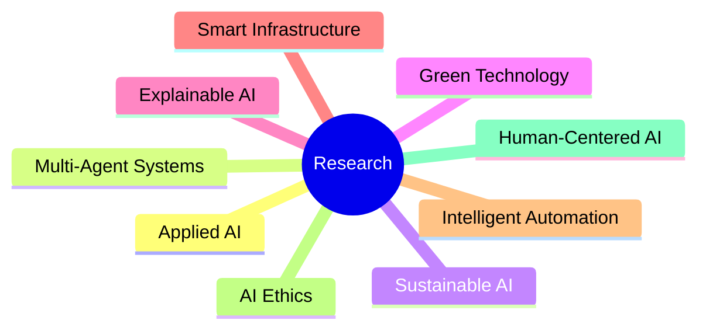

<div align="center">

# Tanvir Akhter Shakib

### Applied AI Researcher • AI Systems Engineer • Data Analyst


<br/>

[](https://linkedin.com/in/tanvirakhtershakib/)
[](https://instagram.com/tanvirakhter.shakib/)
[](https://www.researchgate.net/profile/Tanvir-Akhter-Shakib)
[](https://scholar.google.com/citations?user=HHRHloEAAAAJ)

</div>

---

## About Me

```yaml
Name: Tanvir Akhter Shakib
Role: Applied AI Researcher & Systems Engineer
Education: MSc Data Science & Analytics @ Brunel University London
Focus:
  - Applied Artificial Intelligence
  - Multi-Agent Systems
  - Sustainable & Green Technology
  - Intelligent Automation
  - Explainable AI
  - Smart Infrastructure
Current Work:
  - AI-powered CRM Systems
  - Workflow Intelligence
  - Operational Automation
  - AI Infrastructure
```

---

## Current Focus

<div align="center">

| AI Systems | Sustainability | Research |
|---|---|---|
| Multi-Agent AI | Green Tech | Explainable AI |
| Intelligent Automation | Sustainable Infrastructure | AI for SMEs |
| AI CRM Systems | Smart Systems | Human-Centered AI |

</div>

---

# Tech Stack

## Languages

<p align="center">

</p>

## AI / Data Science

<p align="center">


</p>

## Backend & Cloud

<p align="center">

</p>

## Frontend & Mobile

<p align="center">

</p>

## DevOps & Tools

<p align="center">

</p>

---

# Research Interests

<div align="center">



</div>

---

# Featured Work

## ConneX AI CRM
AI-powered operational platform focused on:
- Multi-Agent AI Orchestration
- AI Receptionist Systems
- Intelligent Workflow Automation
- Real-Time Analytics
- AI-Assisted Customer Engagement

---

# GitHub Analytics

<div align="center">


</div>

---

<div align="center">

### Building intelligent systems for a smarter and more sustainable future.


</div>
